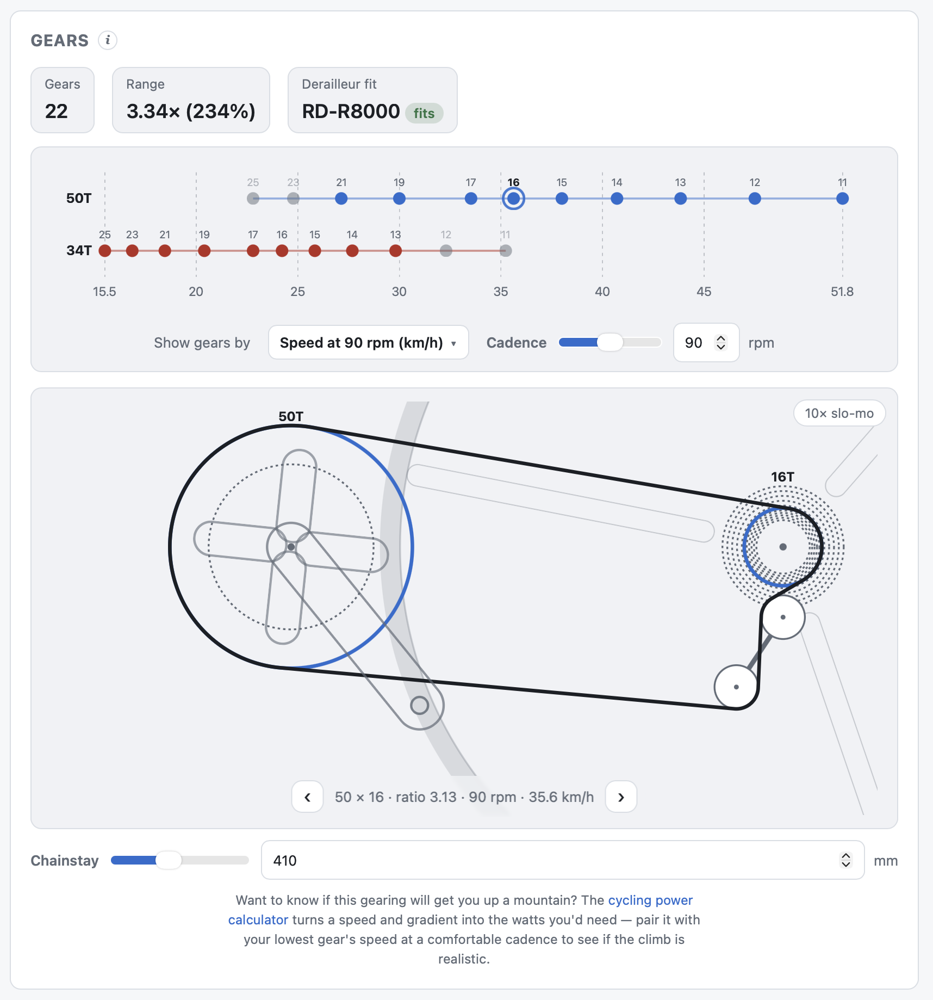
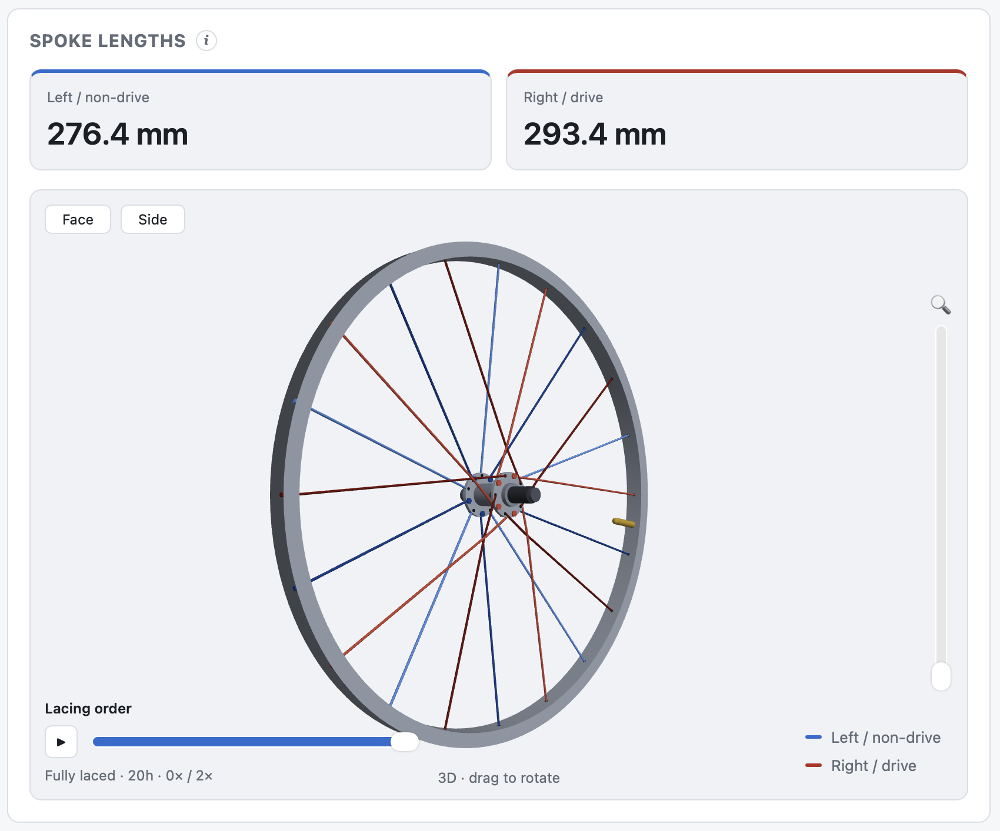

# Bike Workshop Calculator

I am volunteering in a community bike workshop. We repair donated bikes for refugees, and teach people how to fix bikes. Working on bikes often involves small calculations, for which there are many many great web calculators out there. So, why build another one?

- I never remember which one I liked best for which task, so I figured I would like to have a collection of different useful calculators all in one place.
- I wanted to build something which is very visual to let us use this as a tool to teach people how bike components work. So, the drivetrain calculator will actually show an animation of what the drivetrain would look like, and how shifting between the different gears works. The wheel building calculator can show a 3d visualization of the wheel with an animation of which order to put in the spokes when lacing the wheels.
- In our bike workshop, we often have old donated bikes with a very random mix of components - or you may try to find replacements from a box of used parts - and you don't know if components are actually compatible. So one goal of this calculator is to help you answer such questions. The drivetrain calculator lets you specify components (derailleurs, shifters and cassettes) and will validate them against known specs for the parts (gear counts, derailleur pull ratio, max cog size, capacity), to give you a judgement if they are expected to work together or not.

You can try the calculator live on the [Rückenwind web site](https://rueckenwind.berlin/bikeworkshopcalc/).




## Calculators

| # | Calculator | What it answers | Spec |
|---|-----------|-----------------|------|
| 1 | Drivetrain | Gear ratios, speed at cadence, gear inches/development (cassette, single speed, or geared hub), chain length, chain wear | [drivetrain.md](docs/calculators/drivetrain.md) |
| 2 | Wheel building | Spoke lengths for a given hub + rim + lacing, plus spoke tension converter | [wheel-building.md](docs/calculators/wheel-building.md) |
| 3 | Frame size | Frame size / saddle height / crank length from inseam or body height | [frame-size.md](docs/calculators/frame-size.md) |
| 4 | Tire | Convert tire size formats; recommend pressure | [tire.md](docs/calculators/tire.md) |
| 5 | Cycling power | Watts needed for a speed/gradient, and speed from watts | [power.md](docs/calculators/power.md) |
| 6 | Thread direction | Reference: which parts are left-hand threaded, and which way to turn to loosen/tighten | [thread-direction.md](docs/calculators/thread-direction.md) |

## Documentation

- [`docs/architecture.md`](docs/architecture.md) — page layout, navigation, and
  suggested tech approach.
- [`docs/calculators/`](docs/calculators/) — one spec per calculator with
  inputs, outputs, formulas, and reference data.

## Running locally

Requires Node 18+.

```bash
npm install
npm run dev      # start the dev server (http://localhost:5173)
npm run build    # type-check and build the static site into dist/
npm run preview  # preview the production build
npm test         # run the calculation unit tests (Vitest)
```

For a quick visual check of a page (headless Chrome via `puppeteer-core`; set
`CHROME_PATH` to override the browser):

```bash
npm run build && npm run preview -- --port 4320 &
npm run screenshot -- '#/drivetrain' out.png '.gc-dot'   # route, output, optional hover selector
```

The build is a static site (`dist/`) that can be hosted anywhere or opened
offline; `vite.config.ts` uses a relative base so it works from any subpath.

## Tech

- **Vite + React + TypeScript**, all math client-side (no backend).
- Pure calculation modules live in [`src/lib/`](src/lib/) and are unit-tested
  against the worked examples in the calculator specs (`npm test`).
- UI components (one per calculator) live in [`src/components/`](src/components/);
  the sidebar/routing shell is [`src/App.tsx`](src/App.tsx) with a hash router so
  each calculator is bookmarkable (e.g. `#/drivetrain`).

## Contributing

Feedback and suggestions are welcome. So are contributions/pull requests - in particular in the area of adding component data to the Cassette/Hub/Derailleur/Internal Gears [databases](src/data/README.md), but I will look at any submissions.

## License

Released under the [MIT License](LICENSE).
